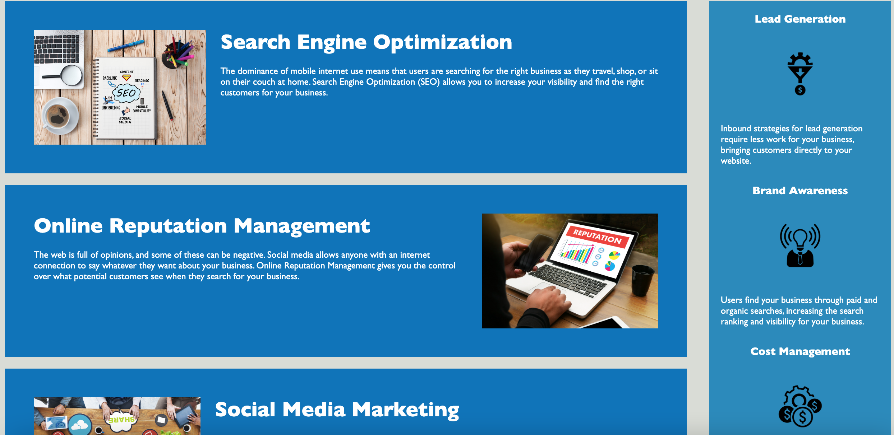
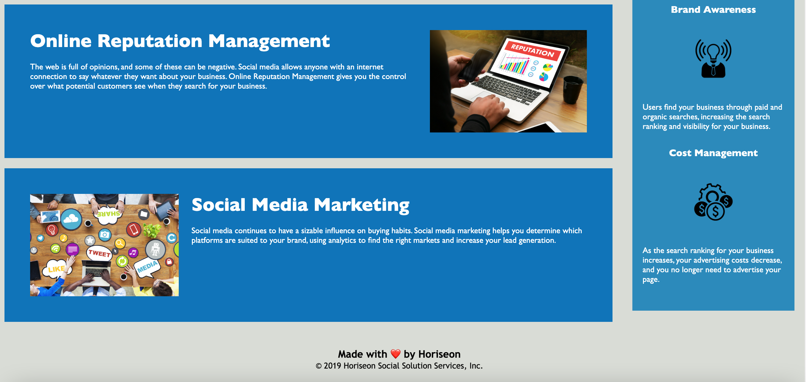

# Horiseon-code-refactor

## This project was to refactor the HTML and CSS for Horiseon. Also to make this site much more accessilbe by adding alt attributes. Most of the HTML on this page had Div tags with classes which could have been cleaner. The same went with the CSS after changing the HTML. The semantic elements could be used in CSS to make changes to the style. This solves the accessibility that the site provides. Also now the performance of the site should be better since the code is a lot cleaner, DRY and concise. The overall learning experince helped me learn to refactor code and add alt attributes as well as regular attributes to make a site more accesible.

# Usage

# MIT License